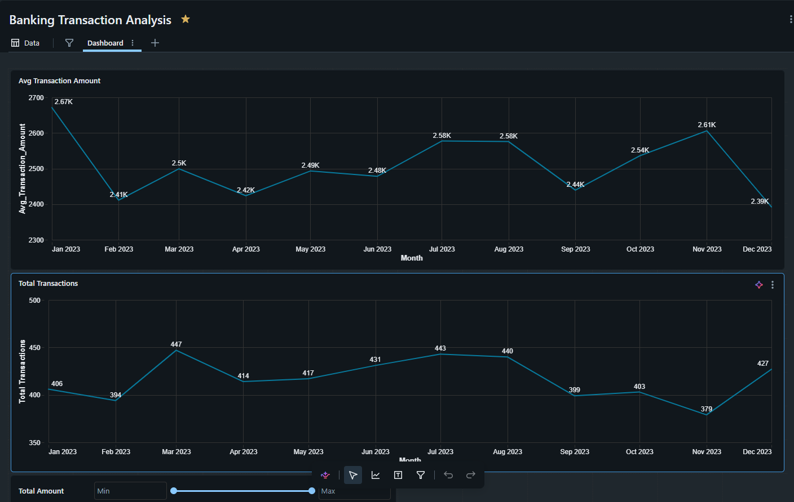
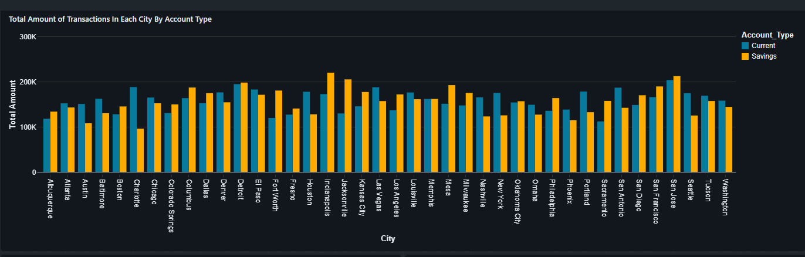

# Banking Transaction Analytics & Risk Monitoring

An end-to-end banking analytics platform built in **Databricks** that combines data engineering, SQL analytics, interactive dashboards, AI-powered querying, and machine learning to simulate a modern banking risk monitoring solution.

---

## Table of Contents

1. [Project Overview](#project-overview)
2. [Dataset](#dataset)
3. [Project Architecture](#project-architecture)
4. [Phase 1 — Data Cleaning & Preparation](#phase-1--data-cleaning--preparation)
5. [Phase 2 — Feature Engineering](#phase-2--feature-engineering)
6. [Phase 3 — SQL Analytics](#phase-3--sql-analytics)
7. [Phase 4 — Dashboard Development](#phase-4--dashboard-development)
8. [Phase 5 — Databricks Genie AI Assistant](#phase-5--databricks-genie-ai-assistant)
9. [Phase 6 — Machine Learning Journey](#phase-6--machine-learning-journey)
10. [Key Business Findings](#key-business-findings)
11. [Technologies Used](#technologies-used)

---

## Project Overview

This project is a comprehensive banking analytics solution that goes beyond traditional reporting. It is designed as both a **business analytics and risk monitoring platform** with a **fraud prediction machine learning component**, capable of:

- Analyzing customer transactions across time, geography, and account type
- Monitoring credit card utilization and its relationship to risk signals
- Evaluating loan approval and rejection patterns
- Identifying potential risk signals through anomaly detection
- Allowing business users to ask natural-language questions through a Databricks Genie AI Assistant
- Predicting customer-level risk using supervised and unsupervised machine learning

> **Note:** The `Anomaly` field in this dataset is not confirmed fraud. It is treated as a **risk signal** derived from transaction behavior, used to engineer supervised learning labels and explore anomaly detection.

---

## Dataset

The project uses a synthetic banking transactions dataset containing approximately:

- **5,000 customers**
- **10,000+ transaction-level records**

| Category | Fields |
|---|---|
| Customer | `Customer_ID`, `Age`, `City` |
| Transaction | `Transaction_Date`, `Transaction_Amount`, `Merchant_Category` |
| Account | `Account_Type` (Savings / Current) |
| Credit Card | `Credit_Limit`, `Credit_Card_Balance` |
| Rewards | `Rewards_Points` |
| Loan | `Loan_Amount`, `Loan_Status`, `Loan_Type`, `Interest_Rate` |
| Risk Signal | `Anomaly` |

---

## Project Architecture

```
Raw Banking Data
      │
      ▼
Data Cleaning & Preparation
      │
      ▼
Databricks Delta Table (Comprehensive_Banking_Clean)
      │
      ├──────► SQL Analytics
      │
      ├──────► Dashboard Visualizations
      │
      ├──────► Genie AI Assistant
      │
      └──────► Machine Learning (Customer Risk ML Dataset)
```

---

## Phase 1 — Data Cleaning & Preparation

The raw dataset was loaded into Databricks and cleaned using PySpark.

**Cleaning steps performed:**

- Column name normalization — stripped whitespace, replaced special characters and spaces with underscores
- Data type verification across all columns
- Null value inspection and duplicate checks
- Anomaly field recoding — original values of `-1` (anomaly) were converted to `1`; all other values set to `0` for binary consistency
- Date processing — `Transaction_Date` parsed to extract `Year` and `Month` for trend analysis

**Key output:** `Comprehensive_Banking_Clean` Delta table saved to the Databricks catalog.

```python
def clean_column(name):
    name = name.strip()
    name = name.replace("/", "_")
    name = name.replace("-", "_")
    name = re.sub(r"[ ,;{}()\n\t=]", "_", name)
    return name

df_cleaned_cols = df_raw.toDF(*[clean_column(c) for c in df_raw.columns])

df_clean = df_cleaned_cols.withColumn(
    "Anomaly",
    when(col("Anomaly") == -1, 1).otherwise(0)
)
```

---

## Phase 2 — Feature Engineering

Several business-focused features were engineered to support analytics, dashboards, and machine learning.

### Credit Utilization Ratio
```python
Credit_Card_Balance / Credit_Limit
```
Measures how heavily a customer is using their available credit. Higher utilization generally signals higher financial pressure and elevated risk.

### Utilization Buckets
Customers categorized into: `Low`, `Medium`, `High`, `Over Limit` — simplifies business reporting and dashboard filtering.

### Rewards Buckets
Customers grouped into: `Low Rewards`, `Medium Rewards`, `High Rewards` — used to analyze whether highly engaged customers show different risk profiles.

### Transaction Ranges
Transactions grouped into: `<100`, `100–499`, `500–999`, `1000+` — used to understand transaction size distribution.

### Risk Label (for Machine Learning)
Customer-level risk labels were engineered by aggregating the transaction-level `Anomaly` field:

```python
customer_features = df.groupBy("Customer_ID").agg(
    avg("Anomaly").alias("Avg_Anomaly"),
    ...
)

customer_features = customer_features.withColumn(
    "Risk_Label",
    when(col("Avg_Anomaly") >= 0.5, 1).otherwise(0)
)
```

| Label | Meaning | Count (approx.) |
|---|---|---|
| `0` | Low Risk | ~4,700 |
| `1` | High Risk | ~300 |

> This severe class imbalance (~94% / 6%) was a defining challenge in the ML phase.

---

## Phase 3 — SQL Analytics

Multiple business-focused SQL queries were developed to support the dashboards and Genie AI assistant.

### Transaction Analysis
```sql
SELECT DATE_TRUNC('month', Transaction_Date) AS Month,
       COUNT(TransactionID)         AS Total_Transactions,
       SUM(Transaction_Amount)      AS Total_Transaction_Amount,
       AVG(Transaction_Amount)      AS Avg_Transaction_Amount
FROM Comprehensive_Banking_Clean
GROUP BY DATE_TRUNC('month', Transaction_Date)
ORDER BY Month;
```

### Transaction Volume by City and Account Type
```sql
SELECT Account_Type, City,
       COUNT(TransactionID)    AS Transaction_Count,
       SUM(Transaction_Amount) AS Total_Amount
FROM Comprehensive_Banking_Clean
GROUP BY Account_Type, City
ORDER BY Total_Amount DESC;
```

### Anomaly Rate vs Credit Utilization
```sql
SELECT ROUND(Credit_Card_Balance / Credit_Limit, 2) AS Utilization_Ratio,
       AVG(Anomaly)                                  AS Avg_Anomaly_Rate,
       COUNT(*)                                      AS Num_Records
FROM Comprehensive_Banking_Clean
WHERE Credit_Limit > 0
GROUP BY ROUND(Credit_Card_Balance / Credit_Limit, 2)
ORDER BY Utilization_Ratio;
```

### Average Customer Risk by Rewards Bucket
```sql
SELECT rewards_bucket,
       AVG(customer_risk) AS avg_customer_risk,
       AVG(avg_rewards)   AS avg_rewards
FROM (
    SELECT Customer_ID,
           CASE
               WHEN AVG(Rewards_Points) < 1000 THEN 'Low Rewards'
               WHEN AVG(Rewards_Points) < 5000 THEN 'Medium Rewards'
               ELSE 'High Rewards'
           END AS rewards_bucket,
           AVG(Anomaly)        AS customer_risk,
           AVG(Rewards_Points) AS avg_rewards
    FROM comprehensive_banking_clean
    WHERE Customer_ID IS NOT NULL
      AND Rewards_Points IS NOT NULL
      AND Anomaly IS NOT NULL
    GROUP BY Customer_ID
)
GROUP BY rewards_bucket
ORDER BY avg_customer_risk DESC;
```

---

## Phase 4 — Dashboard Development

Three interactive dashboards were built inside Databricks using the cleaned Delta table as the data source.

### Transaction Dashboard



| Visual | Description |
|---|---|
| Avg Transaction Amount Over Time | Monthly trend of average transaction value across 2023 (range: ~$2.39K–$2.67K) |
| Total Transactions Over Time | Monthly transaction volume across 2023 (range: 379–447 transactions/month) |
| Total Amount by City & Account Type | Side-by-side comparison of Current vs Savings account spending across 30+ US cities |
| Transaction Count by Amount Range | Distribution showing the majority of transactions fall in the `1000+` range (4,010 transactions) |

### Loan Dashboard

| Visual | Description |
|---|---|
| Loan Status by Loan Type | Auto, Mortgage, and Personal loans broken down by Approved / Closed / Rejected status |
| Loan Approvals Over Time | Monthly approved loan count from Jan 2020 – Dec 2022 |
| Loan Rejections Over Time | Monthly rejected loan count over the same period |

### Risk Dashboard

| Visual | Description |
|---|---|
| Anomaly Rate vs Utilization Ratio | Scatter plot showing anomaly rates rise as credit utilization increases |
| Rewards Points vs Utilization Ratio | Scatter plot showing high rewards customers are not necessarily lower risk |
| Avg Customer Risk by Rewards Bucket | Bar chart showing Low Rewards customers carry the highest average risk (0.07), followed by Medium (0.06) and High (0.06) |

---

## Phase 5 — Databricks Genie AI Assistant


A **Databricks Genie Space** was configured to allow business users to explore the banking dataset using natural language — no SQL knowledge required.

### Configuration

**Semantic layer — custom measures defined:**

| Measure | Formula |
|---|---|
| Average Risk | `AVG(Anomaly)` |
| Total Transactions | `COUNT(*)` |
| Average Transaction Amount | `AVG(Transaction_Amount)` |

**Filters available:** `City`, `Loan_Status`, `Account_Type`

### Example Questions Supported

- *Which branches show unusually high anomaly rates?*
- *Which customers show the highest fraud risk?*
- *Which customers are profitable but potentially risky?*
- *Describe this dataset and the important KPIs I can analyze*
- *Visualize the interesting aspects of the dataset*

### Benchmarking

Ground-truth SQL was manually written for each example question and compared against the SQL generated by Genie to evaluate accuracy and correctness of the AI responses.

---

## Phase 6 — Machine Learning Journey

The ML goal was to predict **customer-level risk** using the engineered `Risk_Label` as the target. All models operated on a **customer-level aggregated dataset** (one row per customer) to prevent data leakage and bias from highly active customers.

### Feature Set

| Feature | Description |
|---|---|
| `Avg_Transaction_Amount` | Average value per transaction |
| `Transaction_Count` | Number of transactions |
| `Total_Transaction_Volume` | Sum of all transaction amounts |
| `Avg_Utilization_Ratio` | Average credit card utilization |
| `Avg_Credit_Card_Balance` | Average outstanding balance |
| `Avg_Rewards_Points` | Average rewards points earned |
| `Avg_Loan_Amount` | Average loan size |
| `Avg_Interest_Rate` | Average interest rate on loans |

---

### Attempt 1 — Logistic Regression

**Approach:** Standard binary Logistic Regression using Spark ML's `LogisticRegression`.

```python
lr = LogisticRegression(
    featuresCol="features",
    labelCol="Risk_Label"
)
model = lr.fit(train_df)
```

**Result:** The model predicted almost exclusively low-risk customers. AUC appeared acceptable on the surface but the confusion matrix revealed near-zero recall for the high-risk class.

**Lesson learned:** Severe class imbalance (~94% low-risk / ~6% high-risk) caused the model to learn the majority class distribution and ignore the minority. A naive accuracy metric is misleading in this context.

---

### Attempt 2 — Weighted Logistic Regression

**Approach:** Same Logistic Regression model but with class weights assigned to penalize misclassifying high-risk customers.

```python
weighted_df = ml_ready_df.withColumn(
    "classWeight",
    when(col("Risk_Label") == 1, 4700 / 300).otherwise(1.0)
)

weighted_lr = LogisticRegression(
    featuresCol="features",
    labelCol="Risk_Label",
    weightCol="classWeight"
)
```

**Result:** Weighted AUC ≈ **0.56**. Modest improvement — the model began identifying some high-risk customers but still struggled with precision on the minority class.

**Lesson learned:** Class weighting helps but is not sufficient when the underlying features do not strongly separate the two classes. The engineered `Risk_Label` (based on average anomaly ≥ 0.5) is a noisy proxy — this limits supervised model ceiling regardless of algorithm choice.

---

### Attempt 3 — Isolation Forest (Unsupervised)

**Approach:** Switched to an unsupervised approach using scikit-learn's `IsolationForest` to detect unusual behavioral patterns directly — without relying on the engineered labels during training.

```python
iso_model = IsolationForest(
    n_estimators=100,
    contamination=0.05,   # assume ~5% of customers are anomalous
    random_state=42
)
iso_model.fit(X)
```

**Result:** ~250 customers flagged as anomalous. F1 score ≈ **0.08** when evaluated against the engineered `Risk_Label`.

**Lesson learned:** The low F1 is expected and does not mean the model is wrong — it reflects that Isolation Forest identifies genuinely *unusual behavioral patterns* that do not necessarily align with the engineered risk labels. This is a valuable finding: the two approaches are detecting different signals, and in the absence of confirmed fraud labels, Isolation Forest offers a complementary, label-free view of customer risk.

---

### ML Summary

| Model | Type | Key Metric | Outcome |
|---|---|---|---|
| Logistic Regression | Supervised | AUC — misleadingly high | Predicted mostly low-risk; class imbalance dominated |
| Weighted Logistic Regression | Supervised (Weighted) | AUC ≈ 0.56 | Modest improvement; label noise limits ceiling |
| Isolation Forest | Unsupervised | F1 ≈ 0.08 vs engineered labels | Detects behavioral anomalies independent of labels |

> **Overall conclusion:** The engineered `Risk_Label` is the primary limiting factor across all supervised models. For a production fraud detection system, confirmed ground-truth fraud labels would significantly improve model performance. The Isolation Forest results are best interpreted as a complementary risk signal rather than a direct competitor to the supervised models.

---

## Key Business Findings

- **Utilization & Risk:** Higher credit utilization ratios consistently correspond with higher anomaly rates — customers using more of their available credit show elevated behavioral risk signals.
- **Rewards & Risk:** High rewards points do not automatically imply lower risk. High-utilization, high-rewards customers represent a high-value but potentially higher-risk segment.
- **Loan Behavior:** Loan status and loan size influence observed risk patterns — customers with active or larger loans show different anomaly profiles.
- **Transaction Volume:** The vast majority of transactions (4,010 out of ~5,000) fall in the `$1,000+` range, suggesting this customer base is predominantly engaged in high-value banking activity.
- **Low Rewards = Highest Risk:** Customers in the Low Rewards bucket carry the highest average customer risk (0.07), slightly above Medium (0.06) and High Rewards (0.06).

---

## Technologies Used

| Category | Tools |
|---|---|
| Platform | Databricks |
| Data Processing | Apache Spark, PySpark, Spark SQL |
| Storage | Databricks Delta Tables |
| Visualization | Databricks Dashboards |
| AI Assistant | Databricks Genie |
| Machine Learning | Spark ML (Logistic Regression, Pipeline, VectorAssembler) |
| Anomaly Detection | Scikit-Learn (Isolation Forest) |
| Evaluation | Scikit-Learn (confusion matrix, classification report, F1 score) |
| Language | Python |
